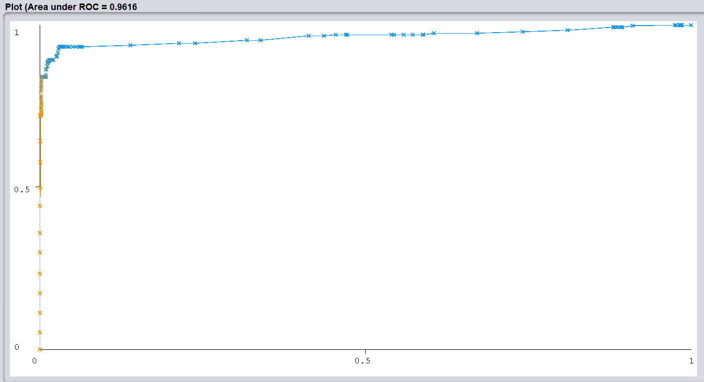

```{r setup, include=FALSE}
knitr::opts_chunk$set(echo = TRUE)
library(pander)
library(dplyr)
library(tidyr)
library(ggplot2)
```


# Exploratory Data Analysis
## Research topic
For this project thyroid disease is the main area of research. Problems with the thyroid will result in mental health problems and fatigue. This can be a severe problem and hard to track down. Luckily machine learning can help figure out and calculate patterns. Patterns that otherwise wouldn't be found otherwise. 

The data was originally gathered from Garvan Institute. Consisting of 9172 records from 1984 to early 1987. There are 30 columns and a lot of instances. All of the thyroid related hormones have been measured, but also external factors are accounted for. Such as medication, a swollen thyroid or a tumour. These factors affect the hormone cycle of the thyroid, changing a persons mental health. The data has a lot of instances, all of these columns contain a true or false. The patient uses medication or not for example. There are only a few numeric columns, these are for the hormone expression values. If the specific hormones (T3 and T4) are measured, the expression value is noted under the <hormone>_measured column. 

Which will bring the research question:

**Is it possible to predict if a person has thyroid disease by using machine learning, looking at expression values, medicine usage and external factors?**

With machine learning, great amounts of data can be loaded up and a model can be constructed. When the algorithm encounters new data, these patterns can be identified and will help improve the model. Since the data has a lot of instances, machine learning will be a great tool to use. Since the data has a Sick column, it's either True or False. So this is supervised learning with classification on Sick. Because this is what a patient will look for. More data will help improve the model. But since there are nine thousand instances, an additional instance won't impact the model. 

## Readying the data
Before the research can start, the data needs to be readied. The original data set needs to be loaded up and readied for usage.

### Loading the data
When initially downloaded, the data had an additional column. This was the patient's case, before starting with machine learning; this needs to be removed as soon as possible. The column `Diagnose Letter` was combined with an id of the patient. This was removed using the regular expression `\[[0-9]+\]`, in order to create a true machine learning algorithm. So the algorithm won't score 100% correct while training.

The labels from the variable `my_labels` were used from the disclosed information in `data/thyroid0387.names`. Only the labels were used, not the additional text and explanation. These are used for readability and make the upcoming graphs better.

```{r loading the data, fig.cap="A peek in the thyroid dataset."}
my_data <- read.table("data/thyroid0387.data", sep = ",", header=F, na="?")
my_labels <- read.table("data/labels.txt", sep="\n", header=F)
colnames(my_data) <- as.vector(my_labels[[1]])

(head(dplyr::as_tibble(my_data), n =5))
```
The data will be loaded using the `read.table` R build-in function. The data does not have a header and uses a `,` as separator. NA (Not available) is defined with a `?` in the data. A lot of external factors such as pregnancy, medication, tumours or a psychiatrist have been taken into account. For most of the instances, this is not the case, so it is labelled with `f`. For the hormone measurement columns, these columns form a combination of name and expression value. The hormone name is simply a true or false, while the measured value is the exact amount of hormone expression measured. If there is no hormone expression measured, it will default to NA. This will not form a big issue since the hormone column gives enough information to work with.

For the label file, the data does not have a header either. The separator is a `\n` and there are no NA's. This data is used to overwrite the current column names with the more easy to understand and practical names.

NA values can be a problem for some algorithms, it is important to keep this in mind when preparing the data. Using `sapply` the NA values can be summed up.

```{r Total amount of NA, echo=FALSE, fig.cap="Amounts of NA found in the data."}
knitr::kable(sapply(my_data, function(x) sum(is.na(x))))
```

Only the sex column has a lot of NAs, this could be because people wouldn't like to include their gender. There are also a lot of NAs in the hormone columns.

## Exploring the data
For the majority of the data, the data is categorical binary data. Which indicates it's either a yes or a no, 1 or 0, True or False. In the dataset these are labelled with either `t` or `f`. But not all, there are also a few numeric values. These numeric values are intervals, and can be used for counting but also used as "in between" values such as decimal numbers. 

The thyroid plays a big part in the endocrine system, it gives off multiple hormones to regulate the body. There are multiple hormones that the thyroid can give off. The values are tests in order to measure the amount of hormone in the blood. Since most of the hormones transport with blood cells, the thyroid values are testable. If there is a value measured, the default false will become true. With the matching value in the hormone_"Measured" column. \cite{synthesis} 

The complete column description is made under `codebook.xlsx`, which describes the column, name, data type, unit and description.

```{r codebook, fig.cap="Codebook of all the columns from the data"}
Openend_codebook_results <- readxl::read_xlsx("resources/codebook.xlsx")
knitr::kable(Openend_codebook_results)
```
 

Hormone information and testing is found on: \cite{hormone information}


All these hormone expression values can be found with tests, in order to prove activity, compare the expression values or prove absence. The test results will be displayed under the measured column in the data. \cite{hormone tests}


The remaining columns are about external factors. Where the body has either abnormalities or lack of hormones/body resources. But since thyroid effects a person's mental health, a psychiatrist is also included. But also pregnancy or a tumour, since these factors can change your life drastically. \cite{hypo}

Now that the data is fully understood, know what all columns do and why it's necessary to include them, the visualization process can begin.

## Visualizing the data
Plotting the data is the fastest way to give a visual view of the data. This can be done by all sorts of ways, since the dataset is mostly categorical; it will be hard to make graphs. Since it is mostly either a `t` or `f` in the dataset. Most of the visualization will be done through tables, due to the lack of numeric values. 

```{r barplot sick, fig.cap="The distribution of sick instances in the thyroid dataset."}
ggplot(data = my_data, mapping = aes(x = sick)) +
  geom_bar(aes(fill = sick)) +
         labs(caption = "Data source: sick column") +
         scale_x_discrete(labels=c("Healthy instances", "Sick instances")) +
         scale_fill_discrete(labels=c("Healthy instances", "Sick instances")) +
         xlab("Classification label") +
         ylab("Frequency in dataset")
```

The great majority of the instances in the data are not patients. Only around 3% of the instances are patients. Which might become tricky to correctly diagnose the real patients according to their thyroid values. Since an algorithm will easily achieve a high accuracy by simple saying that all instances are healthy.

Another factor in the dataset is the sex of the instance. Since thyroid involves many mental problems, fatigue and disorders, there will be a difference between sex. The pregnancy column is also not relevant for all men in the dataset. 

```{r barplot sexes, fig.cap="Distribution of sexes in the dataset."}
ggplot(data = my_data, mapping = aes(x = sex)) +
  geom_bar(aes(fill = sex)) +
         xlab("Sex of the instance") +
         ylab("Frequency in dataset") +
         labs(caption = "Data source: patients' sex in the dataset") +
         scale_x_discrete(labels=c("Female", "Male", "Not included")) +
         scale_fill_discrete(labels=c("Female", "Male", "Not included"))

```

As predicted there are more female instances in the data. There are also people that did not want to specify their sex, these instances are labelled under the 400 NA in the data. Combining this with the lack of male instances, this hurts the credibility. Where ideally it would be an even distribution.

There are many types of diagnosis, in varying degree of frequency. This will give insight in the distribution of the dataset.
```{r frequency in diagnose, fig.cap="Frequency in different diagnosis across the dataset."}
pander(table(my_data$Diagnose_letter))
```
As shown above, not everyone in the dataset is a patient. Some diagnosis are more common than others, a few cases are really rare on a scale of nine thousand instances.

Since there are differences between sexes, not only body but also in hormones. The thyroid might act different, this might affect the effects people feel and how they respond to this.
```{r Diagnosis per sex, fig.cap="Different types of diagnosis and relation to sex."}
ggplot(data = my_data, 
  mapping= aes(x = sex, y= Diagnose_letter)) +
  geom_point(col= "blue", alpha = 0.2) +
  geom_smooth(method="loess", se=FALSE) +
  xlab("Sex of the instance") +
  ylab("Diagnose letters") +
  labs(caption = "Data source: sex and diagnose columns") +
  scale_x_discrete(labels=c("Female", "Male", "Not included")) +
  scale_fill_discrete(labels=c("Female", "Male", "Not included")) +
  theme_minimal()
```

Not all males have the same problems as females, some more frequent then others. NA is added this time to give a general overview of the data.


Another common medicine that helps thyroid patients with their problems is thyroxine. This is additional TT4 hormones that will help the body maintain or keep the cycle it is currently in. But some people use it to cope with problems, these people might falsely think that they are a thyroid patient.
```{r diagnosis thyroxine, fig.cap="Distribution of thyroxine users in the dataset."}
ggplot(data = my_data, 
  mapping= aes(x = on_thyroxine, y= TT4_measured)) +
  geom_jitter(width = 0.4, height = 0.4) +
  geom_point(col= "blue", alpha = 0.2) +
  geom_smooth(method="loess", se=FALSE) +
  xlab("Patient using thyroxine medication") +
  ylab("Measured thyroxine in testing") +
  labs(caption = "Data source: thyroxine usage") +
  scale_x_discrete(labels=c("False", "True")) +
  scale_y_discrete(labels=c("False", "True")) +
  theme_minimal()
```

As seen, the patients that use thyroxine actually translates really well to the data. The True-True combination is proven TT4 and extra thyroid medication. Due to the scope of the data and the big amounts of instances, it might look insignificant. But there are a lot of instances where only a few are actually sick, so it is important to identify them. Thyroxine usage might be useful for the future algorithm.


Overall the data looks really good, but if you look a bit closer, there is something strange going on in the data. The age column has three outliers. Two persons are in their nine thousands' and one person is over four hundred years old. There must have gone something wrong with these values, since it's biologically impossible to be this age. These values need to be either removed or edited.

The instances with unnatural ages are now edited to only use the first two digits. If someone would say forty and a half, and entered it like "40.5". The values combined will be 405 which enters the range of one of the instance's age. All three instances are not sick so the effect will be minimal. 

Now that the unnatural ages have been modified, the data is now clean and seems accurate with the normal age of people. The best way to visualize this, is via a boxplot. To directly show the mean and the quartiles within the age distribution.

```{r age boxplot, fig.cap="A distribution of age within the data"}
ggplot(my_data, aes(y = age, x=as.factor("Patients"))) +
  geom_boxplot() +
  xlab("") +
  ylab("Age spread in years") +
  labs(caption = "Data source: patients' ages from the data") +
  theme_minimal()
```

There are no extreme outliers any more and this is believable. Since it is biological impossible to have such extreme ages. Most of the instances have an age of round 54 years old. While the third quantile leans a bit more towards the older age, since it does not align with the 75 year line.


To finalize the analysis, there are the hormone columns. There are six of these columns, with numeric values and they visualize the expression value. With a boxplot all the additional information about the data will be showed.

```{r hormone expressions, fig.cap="A boxplot of the TT4 expression values."}
ggplot(my_data, aes(y = TT4, x= as.factor("T4") )) +
  geom_boxplot() +
  xlab("") +
  ylab("Gene expression values") +
  labs(caption = "Data source: patients' expression values from the data")
```

There are some outliers in this column, but because this is on the big scale of thousands of instances. This effect is not significant. For this reason, the outliers won't be normalized. Because the gained effect won't change the outcome.


# Machine learning
This is the most important part of the whole process. To see if an algorithm can identify thyroid patients from their expression values. 


## Type 1 and type 2 errors
There are two types of errors, the type-1 error and type-2 errors. The type-1 error is simply a false alarm. Where the algorithm incorrectly said `Yes`, when it should've been a `No`. The type-2 error is a underestimation or a simply a miss, where the algorithm incorrectly said `No` where it should have `Yes`. In this case for type-1, it is a patients that is diagnosed sick that is actually healthy. For the type-2 error, it is a patient that is incorrectly declared healthy, while actually being sick. 

Since the dataset has a lot of patients, where the sick patients are more important. Not only because of the minority but also the sick need to get diagnosed properly. Because around the 90% is healthy, the false positives need to be as low as possible. The patients need to be correctly identified, but the algorithm doesn't need to go too harsh on the healthy instances. 


## Algorithm
### Exploring machine learning
The overall result of the machine learning process is not valid. Due to the skewness of the data, ZeroR will get 97% correct by simply saying False. For OneR will make illogical models, for example "if age is not NA, sick is false." Due to the lack of actual patients in the dataset, the algorithm will won't do a good job on actual patients. The J48 tree will make a simple model with everything resulting in False. NaiveBayes will try, but perform significantly less than zeroR. The only way to get an acceptable score with an actual algorithm is by overfitting on the trainings data. Unfortunately, this won't work for new instances. So the data needs to be trimmed down. Since the ratio is around 9000 healthy and 200 sick, the amount of healthy instances needs to be brought down. While the patient amount should get more weight. 

The extra weight for the sick class, will be done by making a dedicated class column. So there is a sick column, and an additional class column. The only differences are that the NAs will be taken out, so there is a somewhat clean column. There is still a large number of healthy instances, to bring this down way more; around 60% of the healthy instances will be removed. Now the data has 3772 instances, where around 200 instances are sick. With the extra weight of another class column, the results are now a lot better. 

### Running experiments
With the newly made dataset, all algorithms are tested with 10-fold cross validation (not training data). ZeroR keeps performing good, ZeroR will now do 93% correct by simply saying healthy to everyone. But now OneR will do a better job and make an actual model, and will have 96% correct and will base the model on T3 expression. But the J48 tree will do 98.6% correct, with 10-fold cross validation and a minimum number of objects of 10. Picking a number higher will lower the correctly diagnosed sick instances. Picking a lower number will cause overfitting and resulting in more incorrectly diagnosed sick instances. So 10 seems to be a perfect option. 

Increasing or decreasing the minimal number of objects drastically, gives about the same results but different decimals. But there is some mild variation in correctly diagnosed sick instances. Which proves that this model is surprisingly functional. Due to this not being trainings data, this tree should be valid in a more realistic scenario. From the 231 patients, 28 are diagnosed incorrectly healthy. With the massive skewness of this data, only having 231 sick instances, this is a good result. The cleaned and trimmed data can be found under `data/thyroid_final.arff`.

 


Running the J48 algorithm with the optimal options in the Weka experimenter, with 100 runs and 10-fold cross validation, the score will be in the range of 98% and 99% instances correct. This algorithm performs the best, since it diagnoses the most sick instances correct without a lot of False Positives. The False Positives are a lot worse, since the instance is wrongfully judged healthy. A False Negative also has effects, but after a hypothetical medical investigation; the patient will be proven healthy. While a real patient's condition can worsen. The tree also seems logical, since it uses the most obvious columns. An actual doctor would also check hormone expression, then medicine usage and finally the external factors. So the false positives (incorrectly classified healthy) will be weighted more, in order to force the algorithm to classify them correctly.


## Algorithm performance
Multiple test results have been run, the most important factors are displayed under the columns. 
```{r algorithm performance, fig.cap="The performance of various algorithms."}
Openend_ML_results <- readxl::read_xlsx("resources/ML_results.xlsx")
print(Openend_ML_results)
```

Using the function `read_xlsx`` there is a simple way to open an Excel file and displaying the file as a tibble. The J48-Tree proves to be best, since it has the lowest amount of false negatives and false positives. On top of that, it also runs the best with true negatives.

## ROC-Curve
Visualizing the algorithm's performance results can be done via the ROC-Curve. This is a graph of sensitivity as function of specificity, showing how well the algorithm can judge. With 1 being absolutely perfect, judging 100% correctly. But this is not realistic for the algorithm on this specific dataset.

Running the J48-algorithm with 10-fold cross validation, using the optimal 10 minimal number of objects. With the Weka 3.8.5 Experimenter function, rerunning this test 100 times. Generating a total of 1000 trees,



The ROC-Curve comes very close to the top left corner. Which proves that the algorithm performs really well, with an area under the curve of 0.96. An algorithm that has an area under the curve of 1, wouldn't be realistic, so this result is realistic and reasonable. The results are also valid, since there are a lot of trees created and validated, this eliminated the possibility for an "lucky" seed. \cite{ROC}

## Meta-learners 
Combining multiple algorithms and bundling the combined results, can give a very diverse view on the data. With voting, multiple results are joined together and picking the most frequent label. While boosting uses multiple algorithms in an completely different way. With an algorithm being trained on the others mistakes, weighting the wrong instances more. In order to not make the same mistakes again. 


Bagging with bootstrapped data, using REPTree will generate multiple trees with each slightly different data. The bagging algorithm performs well, because it uses the tree structuring, just like J48. Bagging will get an accuracy of 98.4% and an error rate of 1.6%. Using the bagging algorithm with REPTree and it's default settings.

Stacking is using the same algorithm with slightly tweaked seeds, the same algorithm will be run multiple times. Using stacking with OneR with default settings, will give an accuracy 93.8% and an error rate of 6.2%. This sounds high, but it is the same output of ZeroR and diagnoses everyone incorrectly healthy. Stacking J48 will give the same output with judging everyone incorrectly healthy.

Boosting will use multiple of the same algorithms designed to fix each other's mistakes. If an algorithm performs 50% correct and 50% wrong, another algorithm will be specialized to fix the 50% wrong instances. Running this on the thyroid data, an accuracy of 95.8% with OneR. OneR algorithm is trained to fix the other OneR's mistakes. So this is a good way to get valid results with no luck involved. 


\begin{thebibliography}{9}
\bibitem{synthesis}
Boron, W. F., Boulpaep, E. L. (2012). \textit{Medical Physiology Chapter 49, "Synthesis of Thyroid Hormones"} (2nd ed.). Elsevier/Saunders. ISBN 9781437717532.

\bibitem{hormone information}
Basile, L. M. (z.d.). \textit{What are T3, T4, and TSH?} EndocrineWeb. used on 23 September 2021, from https://www.endocrineweb.com/thyroid-what-are-t3-t4-tsh

\bibitem{hormone tests}
Shahid, A. H., Singh, M. P., Raj, R. K., Suman, R., Jawaid, D., Alam, M. (2019). \textit{A Study on Label TSH, T3, T4U, TT4, FTI in Hyperthyroidism and Hypothyroidism using Machine Learning Techniques} 2019 International Conference on Communication and Electronics Systems (ICCES). Published. https://doi.org/10.1109/icces45898.2019.9002284

\bibitem{hypo}
James R Mulinda, Arthur B Chausmer, Francisco Talavera \textit{Hypopituitary Hypopituitarism Causes, Symptoms and Treatment} 2018, January 3rd. EMedicineHealth. $https://www.emedicinehealth.com/hypopituitary/article_em.htm$

\bibitem{ROC}
Swets, J. A. (1996): Signal detection theory and ROC analysis in psychology and diagnostics: Collected papers. Scientific psychology series. Hillsdale, NJ, US: Lawrence Erlbaum Associates, Inc.

\end{thebibliography}


