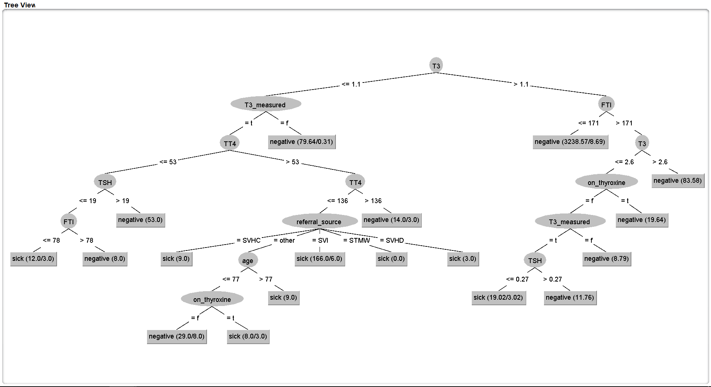

```{r setup, include=FALSE}
knitr::opts_chunk$set(echo = TRUE)
library(ggplot2)
```

```{r echo=FALSE}
my_data <- read.table("data/thyroid0387.data", sep = ",", header=F, na="?")
my_labels <- read.table("data/labels.txt", sep="\n", header=F)
colnames(my_data) <- as.vector(my_labels[[1]])
```


# Data introduction
The data was originally gathered from Garvan Institute. Consisting of 9172 records from 1984 to early 1987. There are 30 columns and a lot of instances. Although there are significantly more healthy than sick instances.

The data is all about people and their thyroid values. All of the thyroid related hormones have been measured, but also external factors are accounted for. Such as medication, a swollen thyroid or a tumour. These factors affect the hormone cycle of the thyroid, changing a persons mental health. The data has a lot of instances, all of these columns contain a true or false. The patient uses medication or not for example. There are only a few numeric columns, these are for the hormone expression values. If the specific hormones (T3 and T4) are measured, the expression value is noted under the <hormone>_measured column. 

```{r codebook, echo=FALSE}
Openend_codebook_results <- readxl::read_xlsx("resources/codebook.xlsx")
knitr::kable(Openend_codebook_results, caption="Codebook of all the columns from the data")
```


# Material and Methods
For the exploratory data analysis, R and Markdown have been used. The version of R is 4.0.4, R has been used as tool for Markdown. R is a programming language used for statistics and data analysis. Graphs can be programmed and is a great tool for research. The graphs were made via the GGplot2 library. dplyr and tidyr were also used as additional tools for data transformation. Finally the pander library was used for displaying tables in a better way than base R. 

All code for the data analysis and workflow can be found in the logbook.
The logbook can be found via GitHub on: https://github.com/Reindert1/Project-praktijk

For the wrapper, the programming language Java has been used. The Java wrapper is made and tested on Java version 16. Via the command line, hormone values can be given and the wrapper will follow the model made in Weka version 3.9.5. 

The Java wrapper also uses multiple dependencies, the common CLI version 1.4 for command line arguments. And the Weka stable version 3.8.5 was used for making the instance object, preparing this object and using the model to classify. Classifying the user's instance and showing this in the terminal output. 

The wrapper can be found on: https://github.com/Reindert1/wekawrapper/tree/master/src/main/java
Readme and support can be directly found on: https://github.com/Reindert1/wekawrapper/blob/master/README.txt


# Results
Of all the 9000 instances, only around the 200 are sick. Since sick is the most valuable column, this will become the class column. The data tells if the patient is either sick or not, so the machine learning algorithm will predict if the patient is sick or not. 

```{r barplot sick, echo=FALSE, fig.cap="The distribution of sick instances in the thyroid dataset."}
ggplot(data = my_data, mapping = aes(x = sick)) +
  geom_bar(aes(fill = sick)) +
         labs(caption = "Data source: sick column") +
         scale_x_discrete(labels=c("Healthy instances", "Sick instances")) +
         scale_fill_discrete(labels=c("Healthy instances", "Sick instances")) +
         xlab("Classification label") +
         ylab("Frequency in dataset")
```
There are a lot more healthy instances than the sick instances. So in order to successfully go to the machine learning process, some trimming needs to be done. 60% of the sick instances have been deleted, this will be done at random to maintain integrity. 


Overall the data is of pretty high quality, there are a lot columns that tell you enough information. The data is relatively complete, not extreme amounts of missing values (NAs). 

```{r Total amount of NA, echo=FALSE}
knitr::kable(sapply(my_data, function(x) sum(is.na(x))), caption = "Amounts of NA found in the data." )
```
Only the sex column has a lot of NAs, this could be because people wouldn't like to include their gender. There are also a lot of NAs in the hormone columns.

All of thyroid hormones are included in the data, and extra hormones like Thyroid stimulating hormone (TSH) are included. So it creates a complete picture of hormones. Most of the patients are healthy, only a small portion of the instances are sick, this might become a problem for the algorithm. Since the algorithm will most likely say "Not sick" and have 80% correct, while the patients with actual thyroid issues might get wrongfully diagnosed. 

```{r barplot sexes, echo=FALSE, fig.cap="Distribution of sexes in the dataset."}
ggplot(data = my_data, mapping = aes(x = sex)) +
  geom_bar(aes(fill = sex)) +
         xlab("Sex of the instance") +
         ylab("Frequency in dataset") +
         labs(caption = "Data source: patients' sex in the dataset") +
         scale_x_discrete(labels=c("Female", "Male", "Not included")) +
         scale_fill_discrete(labels=c("Female", "Male", "Not included"))
```
Since sex is a sensitive topic, the NAs have not been filtered out or filled in. This is because the column does not give a lot of information, because the ratio is not near 50/50. Editing the data will result in major integrity loss, so these instances will stay the way they are. Although it does not give an complete picture and an actual representation of the population.

Since there are differences between sexes, not only body but also in hormones. The thyroid might act different, this might affect the effects people feel and how they respond to this.

```{r Diagnosis per sex, echo=FALSE, fig.cap="Different types of diagnosis and relation to sex."}
ggplot(data = my_data, 
  mapping= aes(x = sex, y= Diagnose_letter)) +
  geom_point(col= "blue", alpha = 0.2) +
  geom_smooth(method="loess", se=FALSE) +
  xlab("Sex of the instance") +
  ylab("Diagnose letters") +
  labs(caption = "Data source: sex and diagnose columns") +
  scale_x_discrete(labels=c("Female", "Male", "Not included")) +
  scale_fill_discrete(labels=c("Female", "Male", "Not included")) +
  theme_minimal()
```
Not all males have the same problems as females, some more frequent then others. NA is added this time to give a general overview of the data.


One of the few numeric columns in the data set, are the hormone expression columns.

```{r hormone expressions, echo=FALSE, fig.cap="A boxplot of the TT4 expression values."}
ggplot(my_data, aes(y = TT4, x= as.factor("T4") )) +
  geom_boxplot() +
  xlab("") +
  ylab("Gene expression values") +
  labs(caption = "Data source: patients' expression values from the data")
```
The hormones are of more value since these columns are numeric. Which is why the machine learning algorithm will most likely chose these columns to start with.

## Cleaning data
When it comes to the dataset, which consists of either True or False, cleaning will become an issue. There are no outliers or impossible values, so the data (when originally downloaded) is mostly clean. There are some measured columns, there are numerical values here, but there are no outliers. So this does not need a lot of work to be done. 


The age column has a lot of outliers, there are a lot of people with inhumane ages. For example three people would be in the nine thousand, one would be eight thousand and one would be four hundred years old. This is not possible of course, these values have been modified to only use the first two digits. If someone would say "I'm forty and a half years" and write it down as 40.50. Due to the use of floats it might got mixed up and combined. To not delete the entire instance, the first two digits will be used to fix this problem. Although this is not the most accurate instance. But on a scale of eight thousand instances, this will not be weighted heavily and won't affect the data. The age of the instances makes a jump from 97 to 400 to 8000, the instances above 97 have been trimmed to their first two digits.

```{r age boxplot, echo=FALSE, fig.cap="A distribution of age within the data"}
ggplot(my_data, aes(y = age, x=as.factor("Patients"))) +
  geom_boxplot() +
  xlab("") +
  ylab("Age spread in years") +
  labs(caption = "Data source: patients' ages from the data") +
  theme_minimal()
```
Now that the data has been filtered of the outlying ages, the data looks a lot more believable. Since it is not possible for a person to be 8 thousand years, there must have gone something wrong with the data. This will increase the data's credibility and makes the conclusions of the algorithm move valid. Because there is no need to take these ages into account and split them in the design later on. 


## Machine learning
Multiple algorithms have been run, but certain algorithms performed better than others. Because of the way the algorithms work. 


After multiple runs, with cross validations and no randomness factors or "lucky seeds"; the J48 tree algorithm performed the best out of them all.


Multiple test results have been run, the most important factors are displayed under the columns. 
```{r algorithm performance, echo=FALSE}
Openend_ML_results <- readxl::read_xlsx("resources/ML_results.xlsx")
knitr::kable(Openend_ML_results, caption = "Results of various machine learning algorithms")
```
The J48-Tree proves to be best, since it has the lowest amount of false negatives and false positives. On top of that, it also runs the best with true negatives.


# Discussion
The data consists mainly of either True or False, so there is little room for outliers and illogical values such as typos or other human errors. This helps the end result in it's integrity. Apart from the age column, which has been modified. Multiple instances have been modified, although this is on a scale on 3 of 9172. This is not significantly for the end result and won't affect the conclusions of the algorithm. Both of the instances are not thyroid patients, so this will fall under the mass of "Not sick". Deleting the instance might result in loss of information, this was the right way to act with these instances. But since this is a human error, it is not certain if this would be the correct for the person. But there is no way to track these individuals down, so there is no other way to either delete or modify the data. 


## Learning pattern
The original data has class labels. Since the instances are patients and Sick is the class column, the data tells if the instance is sick or not. This helps the machine learning section, these labels create a supervised learning environment. This way the algorithm can learn what values the sick patients have and how it differs to the other instances. This has multiple benefits compared to unsupervised, since the criteria will be a lot better and the concept of the algorithm will be better. Supervised learning also prevents the classification errors that unsupervised machine learning has. Since the columns and classes are already readied and human errors have been resolved. 


## Data ratio
A minor issue with the data, is that the male/female ratio is not 50/50. Females stereotypically tend to go more to the doctor. Since the thyroid involves mental health, an adult man won't go to the doctor unless it's absolutely necessary. This is also represented in the data set. There are a lot more females than males in the data, so hormone expression might be different. But sickness is provable due to hormone expression and external factors, so the male/female ratio won't affect the results of the data set. Since the algorithm does not take the sex of the patient (or instance) into account, since this column gives the least amount of information. The information gain is very little since all instances will most likely be female. This won't score highly in bits per instance; so the information gain will be very low. So the results of the algorithm are valid, even though the sex leans more towards female than male. Ideally to isolate the hormone values, without other factors of sex, the ratio would be 50/50.


## Penalty matrix
In the algorithm performance, some choices have been made. What is worse: a false negative or false positive? Since the instances are patients, the false negatives need to be the lowest. If a false positive (incorrectly declared sick) will under go further medical investigation, they'll be proven healthy in the process. This might affect the person a lot, but it will save more lives. Because of the false negatives are lower (incorrectly declared healthy) might have serious issues which have gone under the radar. To prevent bigger issues later on with these instances, the algorithm needed to weight the false negatives heavier than the false positives. The J48-algorithm handles this the best, but additionally the scoring matrix has been used to weight the incorrectly declared healthy instances heavier. This way the overall accuracy was lowered by 0.04 but there was a change of 16 instances, where 7 were sick and correctly classified. Resulting in a gain of 7 correctly classified sick on a scale of 200. And 9 newly wrong classified on a scale of three thousand in the subset data.


# Conclusion 
With the machine learning results and J48 scoring 98.5% accuracy, while classifying 211 correctly sick and the majority of healthy instances correctly. The overall result of the experiment is promising 


To conclude the research project, the original data was relatively clean. Due to the nature of the data, there was little room for outliers and extreme values. The amount of NAs are also relatively low and all relevant columns for the thyroid have been included in the data. External factors are also included and these columns are a great addition to the credibility of the dataset. So the results of the algorithm are valid, biologically and human errors have been filtered out. 


There was a subset used for the machine learning process, since there were too many healthy instances. Resulting in a skewed dataset. After a subset was made, the J48 tree performed exceedingly well. Using the hormone expressions and medication to classify.  In order to lower the amount of incorrectly healthy declared instances, these were given a penalty of 4.0 in the matrix. Resulting in a slightly lower accuracy but overall better performance. J48 is also an algorithm which is easy to understand, since it uses a decision tree. With this model, a Java wrapper was made to classify new instances via the command line. Printing the classification label to the terminal output.


## Future research
A possible follow-up machine learning project, for the high throughput/high performance biocomputing minor.


To take the hormone expression values of the sick instances, and calculate medication via machine learning. In order to bring the expression values within healthy range. With the effect that the sick instance will start to feel better again. Using machine learning for this, the dose can be exact for every patient and machine learning can determine what values would be most beneficial for the patient. The same dataset can be used again, only the algorithm becomes way more complex. But in order to upscale this, more data of thyroid patients need to be collected. Since the data originally had nine thousand healthy instances and only two hundred sick instances.


More maths is involved and the algorithm would be tested on more various levels, in more ways than just class label prediction. This algorithm needs to calculate the hormone up scaling per patient to bring them into more healthy ranges, taking into account all healthy instances. This would not only identify patients, but also help them. 

